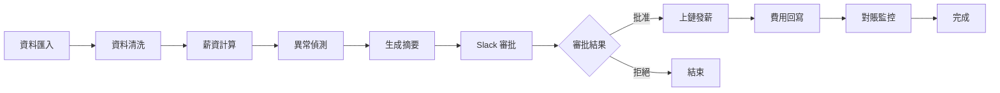

# Arc Payroll System

> **AI-Powered Payroll Management on Arc Testnet**  
> 基於 LangGraph 的自動化薪資發放系統，整合智慧合約批次打款、Slack 審批、異常偵測與對賬監控。

---

## 🎯 專案概述

Arc Payroll 是一個端到端的自動化薪資發放系統，運行在 Arc 測試網上：

- **AI Agent（Python + LangGraph）**：自動化工作流程，包含資料匯入、清洗、計算、異常偵測、審批、上鏈發薪、對賬
- **智慧合約（Solidity）**：`PayrollVault.sol` 支援批次發薪、角色權限、暫停機制
- **管理 UI（Next.js）**：儀表板、批次管理、報表下載
- **監控（Prometheus + Grafana）**：系統指標、效能監控、告警

## 📁 專案結構

```
arc-ai-agent/
├── backend/                    # Python 後端 + AI Agent
│   ├── app/
│   │   ├── agent/             # LangGraph 工作流
│   │   ├── api/               # FastAPI 端點
│   │   ├── core/              # 配置與日誌
│   │   ├── db/                # 資料庫模型
│   │   ├── onchain/           # Web3 整合
│   │   ├── slack/             # Slack 整合
│   │   ├── expense/           # 費用回寫
│   │   └── payroll/           # 薪資業務邏輯
│   ├── abi/                   # 智慧合約 ABI
│   ├── migrations/            # Alembic 遷移
│   ├── scripts/               # 工具腳本
│   ├── docs/                  # 詳細文檔
│   └── docker-compose.yml     # Docker 編排
├── contracts/                  # Solidity 智慧合約
│   ├── contracts/             # 合約原始碼
│   ├── scripts/               # 部署腳本
│   └── hardhat.config.ts      # Hardhat 配置
├── frontend/                   # Next.js 管理介面
│   ├── src/app/               # 頁面與組件
│   └── Dockerfile             # 前端容器
├── ops/                        # 監控配置
│   └── prometheus.yml         # Prometheus 配置
└── Makefile                    # 一鍵指令
```

## 🚀 快速開始

### 前置需求

- Docker & Docker Compose
- Node.js 20+ (用於合約開發)
- Python 3.11+ (本地開發時)

### 1. 初始設定

```bash
# 複製環境變數並編輯
make setup

# 編輯以下文件：
# - backend/.env       (資料庫、Slack、Arc RPC、私鑰等)
# - contracts/.env     (合約部署參數)
# - frontend/.env      (後端 API URL)
```

### 2. 部署智慧合約

```bash
# 安裝依賴並編譯
make contracts-install
make contracts-compile

# 部署到 Arc Testnet
make contracts-deploy

# 記得更新 backend/.env 中的 PAYROLL_CONTRACT_ADDRESS
```

### 3. 啟動系統

```bash
# 啟動所有服務（後端 + 前端）
make up-all

# 或分別啟動
make backend-up    # 後端 API + DB + Redis + 監控
make frontend-up   # 前端 UI
```

### 4. 初始化資料

```bash
# 執行資料庫遷移
make backend-migrate

# 填充測試資料（可選）
make backend-seed
```

### 5. 訪問服務

- **後端 API**: http://localhost:8080
- **前端 UI**: http://localhost:3000
- **Prometheus**: http://localhost:9090
- **Grafana**: http://localhost:3000 (端口衝突，需調整)

## 📖 詳細文檔

更多詳細資訊請參考：

- [**QUICKSTART.md**](backend/docs/QUICKSTART.md) - 詳細快速開始指南
- [**PROJECT_SUMMARY.md**](backend/docs/PROJECT_SUMMARY.md) - 專案架構總覽
- [**INDEX.md**](backend/docs/INDEX.md) - 文檔索引
- [**Backend README**](backend/README.md) - 後端開發指南
- [**Contracts README**](contracts/README.md) - 智慧合約說明
- [**Frontend README**](frontend/README.md) - 前端開發指南

## 🔧 常用指令

```bash
# 查看所有可用指令
make help

# 系統管理
make up-all          # 啟動所有服務
make down-all        # 停止所有服務
make logs            # 查看日誌
make restart         # 重啟所有服務
make status          # 查看系統狀態
make clean           # 清理所有容器和資料

# 後端開發
make backend-up      # 啟動後端
make backend-logs    # 查看後端日誌
make backend-shell   # 進入後端容器
make backend-test    # 執行測試

# 前端開發
make frontend-dev    # 啟動前端開發伺服器（熱重載）
make frontend-lint   # 執行 lint 檢查

# 合約開發
make contracts-compile  # 編譯合約
make contracts-deploy   # 部署合約
```

## 🔄 工作流程



## 🏗️ 技術棧

### 後端
- **框架**: FastAPI
- **AI/工作流**: LangGraph
- **資料庫**: PostgreSQL
- **快取**: Redis
- **區塊鏈**: web3.py
- **監控**: Prometheus + Grafana

### 智慧合約
- **語言**: Solidity 0.8.24
- **工具鏈**: Hardhat
- **函式庫**: OpenZeppelin

### 前端
- **框架**: Next.js 15
- **樣式**: Tailwind CSS
- **狀態管理**: TanStack Query
- **圖表**: Recharts

## 🔒 安全建議

⚠️ **測試網注意事項**：
- 僅使用測試網私鑰
- 不要在合約中存放真實資金
- 定期檢查權限配置

🔐 **主網部署建議**：
- 使用多簽錢包
- 實施嚴格的審批流程
- 考慮 MPC/HSM 管理私鑰
- 進行完整的安全審計

## 🤝 貢獻

歡迎提交 Issue 和 Pull Request！

## 📄 授權

MIT License

---

**由 Arc Hackathon 團隊打造** ⚡
