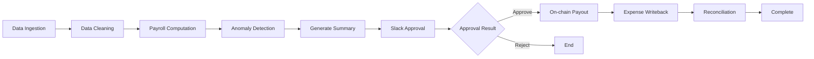

# Arc Payroll System

> **AI-Powered Payroll Management on Arc Testnet**  
> Automated payroll distribution system based on LangGraph, integrating smart contract batch payments, Slack approval, anomaly detection, and reconciliation monitoring.

---

## 🎯 Project Overview

Arc Payroll is an end-to-end automated payroll distribution system running on Arc Testnet:

- **AI Agent (Python + LangGraph)**: Automated workflow including data ingestion, cleaning, computation, anomaly detection, approval, on-chain payouts, and reconciliation
- **Smart Contract (Solidity)**: `PayrollVault.sol` supporting batch payouts, role-based permissions, and pause mechanisms
- **Management UI (Next.js)**: Dashboard, batch management, and report downloads
- **Monitoring (Prometheus + Grafana)**: System metrics, performance monitoring, and alerting

## 📁 Project Structure

```
arc-ai-agent/
├── backend/                    # Python backend + AI Agent
│   ├── app/
│   │   ├── agent/             # LangGraph workflow
│   │   ├── api/               # FastAPI endpoints
│   │   ├── core/              # Configuration and logging
│   │   ├── db/                # Database models
│   │   ├── onchain/           # Web3 integration
│   │   ├── slack/             # Slack integration
│   │   ├── expense/           # Expense writeback
│   │   └── payroll/           # Payroll business logic
│   ├── abi/                   # Smart contract ABIs
│   ├── migrations/            # Alembic migrations
│   ├── scripts/               # Utility scripts
│   ├── docs/                  # Detailed documentation
│   └── docker-compose.yml     # Docker orchestration
├── contracts/                  # Solidity smart contracts
│   ├── contracts/             # Contract source code
│   ├── scripts/               # Deployment scripts
│   └── hardhat.config.ts      # Hardhat configuration
├── frontend/                   # Next.js management interface
│   ├── src/app/               # Pages and components
│   └── Dockerfile             # Frontend container
├── ops/                        # Monitoring configuration
│   └── prometheus.yml         # Prometheus configuration
└── Makefile                    # One-click commands
```

## 🚀 Quick Start

### Prerequisites

- Docker & Docker Compose
- Node.js 20+ (for contract development)
- Python 3.11+ (for local development)

### 1. Initial Setup

```bash
# Copy and edit environment variables
make setup

# Edit the following files:
# - backend/.env       (Database, Slack, Arc RPC, Private Key, etc.)
# - contracts/.env     (Contract deployment parameters)
# - frontend/.env      (Backend API URL)
```

### 2. Deploy Smart Contract

```bash
# Install dependencies and compile
make contracts-install
make contracts-compile

# Deploy to Arc Testnet
make contracts-deploy

# Remember to update PAYROLL_CONTRACT_ADDRESS in backend/.env
```

### 3. Start the System

```bash
# Start all services (backend + frontend)
make up-all

# Or start separately
make backend-up    # Backend API + DB + Redis + Monitoring
make frontend-up   # Frontend UI
```

### 4. Initialize Data

```bash
# Run database migrations
make backend-migrate

# Seed test data (optional)
make backend-seed
```

### 5. Access Services

- **Backend API**: http://localhost:8080
- **Frontend UI**: http://localhost:3000
- **Prometheus**: http://localhost:9090
- **Grafana**: http://localhost:3001

## 📖 Detailed Documentation

For more information, see:

- [**QUICKSTART.md**](backend/docs/QUICKSTART.md) - Detailed quick start guide
- [**PROJECT_SUMMARY.md**](backend/docs/PROJECT_SUMMARY.md) - Project architecture overview
- [**INDEX.md**](backend/docs/INDEX.md) - Documentation index
- [**Backend README**](backend/README.md) - Backend development guide
- [**Contracts README**](contracts/README.md) - Smart contract documentation
- [**Frontend README**](frontend/README.md) - Frontend development guide

## 🔧 Common Commands

```bash
# View all available commands
make help

# System Management
make up-all          # Start all services
make down-all        # Stop all services
make logs            # View logs
make restart         # Restart all services
make status          # Check system status
make clean           # Clean all containers and data

# Backend Development
make backend-up      # Start backend
make backend-logs    # View backend logs
make backend-shell   # Enter backend container
make backend-test    # Run tests

# Frontend Development
make frontend-dev    # Start frontend dev server (hot reload)
make frontend-lint   # Run lint checks

# Contract Development
make contracts-compile  # Compile contracts
make contracts-deploy   # Deploy contracts
```

## 🔄 Workflow



## 🏗️ Tech Stack

### Backend
- **Framework**: FastAPI
- **AI/Workflow**: LangGraph
- **Database**: PostgreSQL
- **Cache**: Redis
- **Blockchain**: web3.py
- **Monitoring**: Prometheus + Grafana

### Smart Contracts
- **Language**: Solidity 0.8.24
- **Toolchain**: Hardhat
- **Libraries**: OpenZeppelin

### Frontend
- **Framework**: Next.js 15
- **Styling**: Tailwind CSS
- **State Management**: TanStack Query
- **Charts**: Recharts

## 🔒 Security Recommendations

⚠️ **Testnet Considerations**:
- Use testnet private keys only
- Do not store real funds in contracts
- Regularly review permission configurations

🔐 **Mainnet Deployment Recommendations**:
- Use multi-signature wallets
- Implement strict approval processes
- Consider MPC/HSM for private key management
- Conduct thorough security audits

## 🤝 Contributing

Issues and Pull Requests are welcome!

## 📄 License

MIT License

---

**Built by Arc Hackathon Team** ⚡
